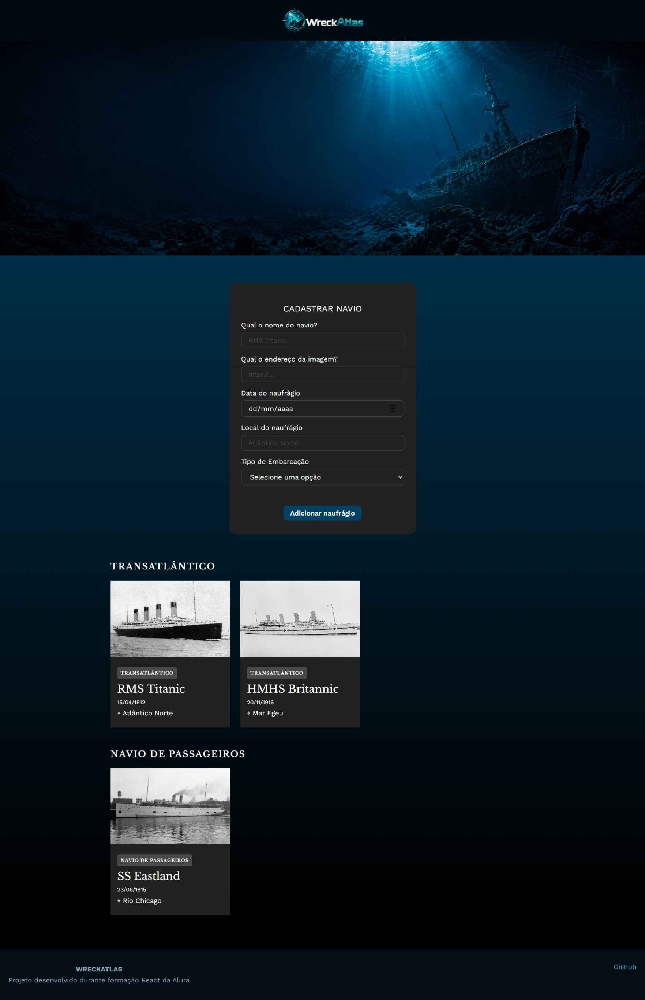

# WreckAtlas

O **WreckAtlas** é uma aplicação desenvolvida em React para cadastrar e organizar informações sobre naufrágios, reunindo embarcações de diferentes tipos em um catálogo temático.

O projeto surgiu a partir de uma aplicação criada durante meus estudos de React na **Alura**. Na versão original, chamada **Tecboard**, a proposta era cadastrar eventos relacionados à tecnologia e organizá-los por categorias.

Para transformar o projeto em algo com uma identidade própria, a aplicação foi adaptada para o tema de naufrágios. Foram alterados o design, os textos, os campos do formulário, as categorias e o conteúdo exibido nos cards. Também foi adicionada persistência com **localStorage**, permitindo que os naufrágios cadastrados permaneçam salvos mesmo após atualizar a página.


## Funcionalidades

- Cadastro de naufrágios
- Nome da embarcação
- Imagem da embarcação
- Data do naufrágio
- Local do naufrágio
- Classificação por tipo de embarcação
- Organização dos cards por categoria
- Persistência dos dados com `localStorage`

## Tipos de embarcação

Os naufrágios podem ser organizados nas seguintes categorias:

- Transatlântico
- Navio de guerra
- Cargueiro
- Navio mercante
- Navio de passageiros
- Submarino
- Outros

## Tecnologias utilizadas

- React
- JavaScript
- CSS
- Vite
- Web Storage API (`localStorage`)

## Screenshots

### WreckAtlas



## Principais mudanças em relação ao Tecboard

A versão original era voltada ao cadastro de eventos de tecnologia. No WreckAtlas, foram realizadas mudanças como:

- nova identidade visual inspirada em exploração marítima e naufrágios;
- substituição dos eventos por embarcações naufragadas;
- alteração das categorias para tipos de embarcação;
- inclusão do local do naufrágio;
- adaptação da data para representar a data do naufrágio;
- criação de novos cards e conteúdo temático;
- persistência dos dados utilizando `localStorage`.

## Como executar o projeto

Clone o repositório:

```bash
git clone https://github.com/nixon-alves/wreckatlas.git
```

Entre na pasta do projeto:

```bash
cd wreckatlas
```

Instale as dependências:

```bash
npm install
```

Execute em ambiente de desenvolvimento:

```bash
npm run dev
```

## Deploy

🔗 [Acesse o WreckAtlas](https://wreckatlas-eight.vercel.app/)

## Origem do projeto

Este projeto foi desenvolvido durante meus estudos de React na **Alura** e posteriormente personalizado antes de sua publicação no GitHub.

A proposta original serviu como base para praticar conceitos de React. A partir dela, o projeto recebeu uma nova temática, identidade visual, estrutura de dados e persistência no navegador.

---

Desenvolvido durante a formação em React da Alura.
